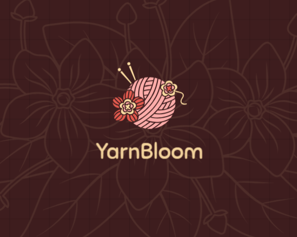

*YarnBloom* – Crochet Website

A responsive crochet-themed website showcasing handmade products, digital patterns, and beginner-to-advanced learning sections. Built using HTML, CSS, and JavaScript, focused on clean UI and user-friendly experience.

## Live Demo


## Features
- Beautiful crochet product showcase
- Add to cart functionality
- Wishlist feature
- Interactive FAQ section
- Beginner → Advanced learning levels UI
- Fully responsive design (mobile-friendly)
- Modern and aesthetic UI

 ## Tech Stack
HTML5
CSS3
JavaScript (Vanilla JS)


## Project Structure
```
YarnBloom/
│
├── .github/
│   ├── ISSUE_TEMPLATE/
│   │   ├── bug_report.md
│   │   ├── feature_request.md
│   │   ├── question.md   (optional)
│   │
│   ├── PULL_REQUEST_TEMPLATE.md
│
├── CONTRIBUTING.md
├── CODE_OF_CONDUCT.md
│
├── levels/
│   ├── images/
│   ├── advanced.html
│   ├── easy.html
│   ├── intermediate.html
│   ├── levels.css
│
├── shop/
│   ├── shop.css
│   ├── shop.html
│   ├── shop.js
│
├── index.html
├── script.js
├── style.css
├── logo.png
└── README.md
```


 ## How to Run Locally
- Clone the repository
- git clone https://github.com/Smrithi-krishna/Crochet-website.git
- Open the project folder
- cd yarnbloom
- Open index.html in your browser

## Future Improvements
- Backend for real cart system
- User authentication
- Payment integration
- Product database (MongoDB/Firebase)
- Animated UI enhancements


## Contributing

This is a personal learning project, but suggestions are welcome!

## Author

Smrithi Krishna


## License

This project is open source and free to use for learning purposes.
